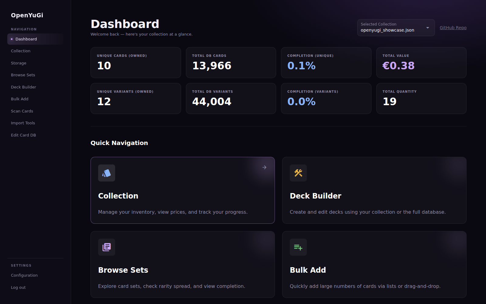

# OpenYuGi

OpenYuGi is a local-first Yu-Gi-Oh! collection manager, deck builder, and card-scanning application. It runs as a NiceGUI web application on your computer and stores your collection in readable files under `data/`; no hosted account or external database is required.

It is designed for both players and collectors. Player-oriented views consolidate alternate printings so you can answer “do I own three copies?”, while collector-oriented views preserve the exact set, rarity, artwork, condition, language, edition, value, and physical storage location of each copy.

> **Default login:** `admin` / `admin`
> Change these credentials in **Settings → Account security** immediately after the first login, especially if OpenYuGi is reachable by another device.



## Contents

- [What OpenYuGi provides](#what-openyugi-provides)
- [Quick start](#quick-start)
- [First-run setup](#first-run-setup)
- [Using the application](#using-the-application)
- [Scanner setup and operation](#scanner-setup-and-operation)
- [Local data, backups, and offline use](#local-data-backups-and-offline-use)
- [Configuration and security](#configuration-and-security)
- [Architecture](#architecture)
- [Development](#development)
- [Troubleshooting](#troubleshooting)
- [Documentation index](#documentation-index)
- [License and legal notice](#license-and-legal-notice)

## What OpenYuGi provides

### Collection and inventory management

- Create separate collections for personal cards, trades, sealed products, or any other workflow.
- Track printings by set code, rarity, and artwork rather than collapsing every copy into a single record.
- Track physical entries by condition, language, first-edition status, storage location, quantity, purchase price, purchase date, and market value.
- Switch between **Consolidated / Player** mode and **Collector / Variant** mode.
- Search, filter, sort, and paginate large collections by card and printing metadata.
- Review total quantity, unique cards, unique variants, estimated value, rarity distribution, language distribution, and completion metrics on the dashboard.
- Undo supported collection and batch operations through the local changelog system.

### Set browsing

- Browse the locally cached Yu-Gi-Oh! set database.
- Inspect the cards and rarities in a set.
- Compare a set checklist with a selected collection to see owned and missing printings.
- Download pack imagery or import set data from Yugipedia when the upstream database needs an addition.

### Physical storage

- Define binders, boxes, sealed products, and other storage locations inside a collection.
- Attach a description, image, or set association to a storage definition.
- Browse locations in gallery and detail views, including each location's assigned-card count.
- Move exact card entries between locations, including batch and drag-and-drop workflows.
- Rename a location while keeping its card assignments consistent.

### Deck building

- Build Main, Extra, and Side Decks from the full card database.
- Compare deck requirements with a selected physical collection.
- Resolve alternate artwork IDs back to the base card identity for ownership and restriction checks.
- Import, save, organize, and export standard `.ydk` files.
- Export full decks or missing-card lists as YDK, CSV, JSON, or Cardmarket wants-list text.
- Download and enforce TCG, OCG, Goat, and Genesys restrictions; custom banlists can also be saved locally.
- Automatically route Extra Deck monster types and report deck or banlist violations.

### High-volume entry and import

- Use the two-pane Bulk Add page to search the database and stage many collection changes quickly.
- Apply condition, language, edition, quantity, and storage metadata to batches.
- Import OpenYuGi JSON backups and Cardmarket PDF or text exports.
- Preview and correct parsed rows before committing them.
- Merge collections without requiring a server-side database.

### Local database editing

- Correct local card metadata without waiting for an upstream data source.
- Add individual cards or sets from Yugipedia.
- Import Cardmarket information and maintain local pricing references.
- Keep collection files focused on owned-card state while joining card metadata at runtime.

### Webcam scanner (beta)

- Capture a card in the browser and process it locally.
- Detect and flatten card boundaries using classic OpenCV or experimental YOLO preprocessing.
- Run EasyOCR and/or DocTR against the warped card.
- Detect likely set codes, names, edition text, rarity information, and card art.
- Compare art against an index built from `data/images/`.
- Pause for manual resolution when competing matches are too close.
- Inspect intermediate images, OCR output, confidence, and pipeline steps in the Debug Lab.

The scanner is an assistive beta feature, not a guarantee of printing-level identification. Confirm ambiguous or valuable cards before committing them to a collection.

## Quick start

### Requirements

- Python 3.10 or newer; Python 3.11 is the version used by the packaged-build workflow.
- Git.
- A modern browser.
- An internet connection for the initial card database download, image downloads, banlist refreshes, pricing data, and Yugipedia imports.
- Additional disk space if you download the full image cache, especially high-resolution images.

The scanner dependencies are included in `requirements.txt`. A CUDA-capable GPU can improve some model workloads but is not required. OpenYuGi uses EasyOCR and DocTR; it does **not** use Tesseract.

### 1. Clone the repository

```bash
git clone https://github.com/DJ-Cat-N-Cheese/Yu-Gi-Oh-Card-Tracker.git
cd Yu-Gi-Oh-Card-Tracker
```

### 2. Create an isolated environment

Using Python's built-in virtual environment support:

```bash
python -m venv venv
```

Activate it on Linux or macOS:

```bash
source venv/bin/activate
```

Activate it in Windows PowerShell:

```powershell
.\venv\Scripts\Activate.ps1
```

Conda is also supported:

```bash
conda create -n openyugi python=3.11 -y
conda activate openyugi
```

### 3. Install dependencies

```bash
python -m pip install --upgrade pip
python -m pip install -r requirements.txt
```

Torch, OCR, OpenCV, and Ultralytics make this a relatively large environment. Installation time and download size are normal.

### 4. Run OpenYuGi

Run the application from the repository root so its relative data paths resolve correctly:

```bash
python main.py
```

NiceGUI normally opens the browser automatically. Otherwise, visit <http://localhost:8080>, sign in with `admin` / `admin`, and change the credentials in Settings.

Stop the server with `Ctrl+C` in the terminal.

## First-run setup

Open **Settings** after signing in. The data-management actions let you prepare only the caches you need:

1. **Update card database** downloads metadata for the selected application language.
2. **Update all languages** downloads every supported language database.
3. **Download set info & images** refreshes set statistics and pack artwork.
4. **Download Yugipedia set images** fills or replaces pack artwork from Yugipedia.
5. **Download low-res card images** prepares a compact local card-image cache.
6. **Download high-res card images** uses substantially more time, bandwidth, and storage.
7. **Generate sample collection** creates example data for exploring the interface.

OpenYuGi also downloads individual card images lazily when they are requested, so a complete image download is optional. Once the required metadata and images are cached, routine collection and deck work can continue offline. Features that refresh external data still require a connection.

## Using the application

### Dashboard

The dashboard is the collection overview. Select a collection to display unique-card and variant completion, total quantity, estimated Cardmarket-based value, and rarity and language charts. Its shortcuts lead to the main workflows.

### Collection

The Collection page is the primary inventory editor.

- **Consolidated / Player view** groups all printings under the base card identity and emphasizes total ownership.
- **Collector / Variant view** separates exact printings and artwork variants for valuation and storage work.
- The detail view exposes entries for different conditions, languages, editions, and locations.
- Filters can be combined with ownership and sort controls.
- Collection files may be JSON, YAML, or YML, although JSON is the normal format.

Yu-Gi-Oh! APIs sometimes assign separate IDs to alternate artwork. OpenYuGi retains the printing's image ID while resolving gameplay-oriented counts to the base card where necessary.

### Browse Sets

Use Browse Sets as a visual checklist. Select a collection, open a set, and compare its printings with what you own. The page can also import a missing set from Yugipedia.

### Storage

Storage definitions belong to a collection. Create locations that mirror your room—for example, `Trade Binder`, `Bulk Box A`, or `Deck Case`—then assign entries to them. Moving a card changes its location without losing printing, condition, language, or edition metadata.

### Deck Builder

Decks are saved as `.ydk` files under `data/decks/` and may be organized into groups. Select a collection to show ownership while building. Select a banlist to check classical copy limits or Genesys points. The export dialog can produce a complete deck or only the missing cards.

Deck availability is advisory: always confirm the current official tournament policy and effective banlist before an event.

### Bulk Add

Bulk Add is intended for booster openings, purchased lots, and inventory corrections. Search the library on the left, stage or adjust collection entries on the right, and apply shared metadata in batches. The page records supported changes so the most recent action can be undone.

### Import Tools

Import Tools accepts:

- an OpenYuGi JSON collection or scan export;
- Cardmarket PDF or text exports; and
- another local collection for merging.

Review the preview before committing an import, particularly when a source lacks an exact image ID, rarity, or localized set code.

### DB Editor

The DB Editor changes cached reference metadata, not the owned-card hierarchy embedded in a collection. It is useful for newly announced cards, missing promotional cards, incorrect set data, and Cardmarket references. Back up `data/` before large manual edits.

## Scanner setup and operation

### Physical setup

Scanner accuracy depends more on the capture environment than on any single model setting:

1. Mount the camera so it is stable and approximately parallel to the card.
2. Place the entire card on a plain, matte surface with strong border contrast.
3. Use bright, diffuse, indirect lighting.
4. Avoid direct reflections from sleeves and foil patterns.
5. Grant camera permission to the browser and close other applications using the camera.

A light background can work well with the preprocessing mode optimized for light surfaces; a dark playmat can work better for light card borders. Use the Debug Lab to see which choice produces a clean contour on your hardware.

### Processing flow

```text
Browser capture
    ↓
Edge or YOLO card detection
    ↓
Perspective correction and region extraction
    ↓
EasyOCR / DocTR text recognition
    ↓
Edition, rarity, type, and art analysis
    ↓
Heuristic candidate scoring
    ↓
Automatic result or ambiguity dialog
```

The `ScannerManager` performs processing on a dedicated worker thread. It places requests on a queue and emits lifecycle events; the NiceGUI page consumes those events with a timer instead of updating UI objects directly from the worker thread.

### Debug Lab controls

- **Classic preprocessing** uses thresholding, contours, and perspective correction. It is fast and works best with a controlled background.
- **YOLO preprocessing** is experimental and can help when classic contour detection is unreliable.
- **DocTR** is the default OCR track and is generally the stronger option for small or skewed text.
- **EasyOCR** is available as an alternate track for comparison.
- **Art Match** compares a cropped artwork feature against a local index. Use **Index Images** after adding or replacing images.
- **Ambiguity threshold** controls how close candidate scores may be before manual selection is required. Keep the default until the rest of the pipeline is stable.

For pipeline screenshots and more detailed diagnostics, see [Card Scanning](docs/CardScanning.md).

## Local data, backups, and offline use

There is no SQL or NoSQL database. Persistent application state is stored in ordinary files, primarily beneath `data/`.

| Path | Purpose |
| --- | --- |
| `data/collections/` | Collection JSON/YAML files and uploaded storage images |
| `data/decks/` | `.ydk` deck files and deck-group directories |
| `data/db/` | Cached card and set metadata |
| `data/images/` | Lazy or bulk-downloaded card images and art-match source images |
| `data/sets/` | Cached set artwork |
| `data/banlists/` | Downloaded and custom banlists |
| `data/prices/` | Local pricing caches |
| `data/changelogs/` | Collection and deck operation history used by undo workflows |
| `data/scans/` | Temporary scan-session data and captured diagnostics |
| `data/ui_state.json` | Last selections, filters, and view preferences |
| `data/scanner_config.json` | Scanner track and threshold preferences |
| `data/.storage_secret` | Auto-generated session-signing secret |
| `config.json` | Application settings and the hashed local-account password |

The entire `data/` tree and `config.json` are ignored by Git because they are installation-specific and may contain private inventory or security state.

### Backing up

1. Stop OpenYuGi so no write is in progress.
2. Copy `data/` and `config.json` to a versioned backup location.
3. Protect the backup like the original: it contains inventory, pricing, settings, and session/authentication material.

If space is limited, `data/images/` and `data/sets/` can usually be excluded because they can be downloaded again. Keep `data/collections/`, `data/decks/`, and any custom database or banlist content you cannot recreate.

Test important backups by restoring them into a separate OpenYuGi checkout. A backup that has never been restored is only an assumption.

### Collection data model

The collection hierarchy separates card identity, printing identity, and physical copies:

```text
Collection
└── CollectionCard                 base card identity (`card_id`)
    └── CollectionVariant          set + rarity + artwork (`variant_id`)
        └── CollectionEntry        condition + language + edition + location
```

- `CollectionCard` groups an abstract card identity by API card ID.
- `CollectionVariant` identifies a printing. Its deterministic ID incorporates card ID, set code, rarity, and image ID so alternate artwork remains distinct.
- `CollectionEntry` represents a physical stack. Entries with the same condition, language, first-edition flag, and storage location share one quantity.
- `ApiCard` reference objects come from the local API cache and are joined at runtime. They are not serialized into a user's collection.

A shortened collection file looks like this:

```json
{
  "name": "Main Collection",
  "description": "Personal cards",
  "storage_definitions": [
    {
      "name": "Binder 1",
      "type": "Binder",
      "description": "Main trade binder"
    }
  ],
  "cards": [
    {
      "card_id": 46986414,
      "name": "Dark Magician",
      "variants": [
        {
          "variant_id": "deterministically-generated-id",
          "set_code": "LOB-EN005",
          "rarity": "Ultra Rare",
          "image_id": 46986414,
          "entries": [
            {
              "condition": "Near Mint",
              "language": "EN",
              "first_edition": true,
              "quantity": 2,
              "storage_location": "Binder 1",
              "purchase_price": 0.0,
              "market_value": 0.0,
              "purchase_date": null
            }
          ]
        }
      ]
    }
  ]
}
```

Collection files are loaded into Pydantic models and saved by replacing the full file through the persistence layer. Do not edit a collection while OpenYuGi is running; the next application save may overwrite the external change.

## Configuration and security

OpenYuGi uses a single local account and session-based authentication. UI pages, API routes, debug routes, and application data routes are protected by the authentication middleware.

- Default credentials are `admin` / `admin`.
- Passwords are stored as salted scrypt hashes in `config.json`, not as plaintext.
- Changing credentials invalidates existing authenticated sessions.
- `data/.storage_secret` signs sessions and is created with restrictive file permissions where the platform supports them.
- OpenYuGi does not configure TLS. If you expose it beyond localhost, place it behind a correctly configured HTTPS reverse proxy and restrict network access.

Supported environment overrides include:

| Variable | Purpose |
| --- | --- |
| `OPENYUGI_ADMIN_USERNAME` | Override the configured login username |
| `OPENYUGI_ADMIN_PASSWORD_HASH` | Override the configured Werkzeug-compatible password hash |
| `OPENYUGI_STORAGE_SECRET` | Provide a stable session secret of at least 32 characters |
| `OPENYUGI_SECURE_COOKIES` | Set to `1`, `true`, or `yes` when serving exclusively through HTTPS |
| `OPENYUGI_ENABLE_DEBUG_STATIC` | Expose the local `debug/` directory at `/debug`; use only for controlled debugging |

The local-first model keeps collection data on your machine, but some actions intentionally contact external services, including YGOPRODeck, Yugipedia, Cardmarket pages, and banlist sources. OpenYuGi does not make those refresh features offline by pretending stale data is current.

## Architecture

OpenYuGi is a server-rendered Python application built with NiceGUI, FastAPI, Pydantic, and local filesystem persistence.

### Repository layout

| Directory | Responsibility |
| --- | --- |
| `src/core/` | Domain models, configuration, persistence, constants, and changelogs; no UI code |
| `src/services/` | Collection mutation, APIs, authentication, pricing, images, imports, storage, and other integrations |
| `src/services/scanner/` | Computer-vision models, pipeline, worker manager, and scan events |
| `src/ui/` | NiceGUI pages, layout, theme, and page controllers |
| `src/ui/components/` | Reusable card, filter, structure-deck, and ambiguity components |
| `src/api/` | Authenticated FastAPI request models and `/api/v1` routes |
| `tests/` | Automated test suite |
| `docs/` | Feature guides and screenshots |
| `data/` | Runtime user data and caches; ignored by Git |

### Important implementation rules

1. **Use `CollectionEditor` for card inventory mutations.** It creates and removes parent nodes, merges equivalent entries, generates variant IDs, and performs storage transfers consistently. UI code must not mutate `Collection.cards` directly.
2. **Keep the UI event loop non-blocking.** Filesystem operations, network calls, and heavy computation must run through `await run.io_bound(...)`, an asynchronous client, or a dedicated worker thread.
3. **Deep-copy mutable Pydantic state for snapshots.** Use `model.model_copy(deep=True)` when an undo snapshot or isolated working copy is needed.
4. **Preserve card identity semantics.** Alternate-art IDs need to resolve to their base ID for gameplay ownership and banlist calculations while remaining distinct for collector inventory.
5. **Keep API metadata transient.** A collection stores ownership state, not a duplicate of the full `ApiCard` database.
6. **Update NiceGUI only from its UI context.** Background scanner threads emit queued events; they do not call `ui.notify` or mutate components directly.

`AGENTS.md` is the authoritative architectural manual for contributors and coding assistants. Read it before changing implementation code.

### Collection transaction flow

```text
UI or API request
    ↓
Load Collection Pydantic model
    ↓
CollectionEditor.apply_change(...) / move_card(...)
    ↓
Record supported changelog operation
    ↓
PersistenceManager saves a full replacement file
    ↓
Refresh the affected UI state
```

### Drag and drop

Bulk Add and Storage use SortableJS in the browser. A frontend `onAdd` handler dispatches a `card_drop` event containing the card and source/target identifiers. The Python handler validates the event, performs the backend mutation, saves the collection, and refreshes the rendered content.

### Authenticated API

The application includes authenticated `/api/v1` endpoints for collection listing and mutation, card and set reference data, imports, and changelog access. The browser session authentication also protects these routes; unauthenticated API requests receive HTTP 401. Inspect `src/api/routes.py` and its Pydantic request models before integrating an external client.

## Development

### Run from source

```bash
python main.py
```

Always run commands from the repository root. Relative paths such as `data/collections/` and `config.json` are intentional.

### Run tests

Install pytest if your development environment does not already provide it:

```bash
python -m pip install pytest
python -m pytest tests/
```

Tests must isolate user data in temporary directories. Mock NiceGUI, OpenCV, network requests, and other optional or heavyweight integrations where the test does not specifically exercise them. Do not write test fixtures into the real `data/` directory.

### Build a distributable application

The repository's cross-platform workflows package OpenYuGi with PyInstaller. To make the same one-directory build locally:

```bash
python -m pip install pyinstaller
python build.py
```

Build output is written beneath `dist/OpenYuGi/`. Platform-specific binaries should be built on their target operating system.

### Contribution workflow

1. Fork the repository and create a focused branch from `main`.
2. Read `AGENTS.md` and the guide for the subsystem you intend to change.
3. Keep domain logic in `src/core/` or `src/services/`; keep presentation in `src/ui/`.
4. Add or update isolated tests for behavioral changes.
5. Run `python -m pytest tests/` from the repository root.
6. Check `git diff` for generated images, logs, caches, local data, and credentials before committing.
7. Open a pull request that explains the problem, solution, verification, and any new dependencies or migration concerns.

## Troubleshooting

### The application does not start

- Confirm the virtual environment is active and rerun `python -m pip install -r requirements.txt`.
- Run `python main.py` from the repository root.
- Read the terminal output and `logs/app.log` for the first exception.
- If port 8080 is already occupied, stop the other process before restarting OpenYuGi.
- If `config.json` is invalid, move it aside while OpenYuGi is stopped and restart to generate defaults. Keep the old file until any needed settings are recovered.

### `ModuleNotFoundError`

The usual causes are an inactive virtual environment, an incomplete dependency installation, or launching from another working directory. Activate the environment, install `requirements.txt`, and run from the checkout root.

### Images are missing

- Check the network connection for an image that has not been cached.
- Confirm the process can write to `data/images/` and `data/sets/`.
- Use the corresponding download action in Settings to prefetch images.
- Rebuild the scanner art index after replacing art-match images.

### Saving reports `PermissionError` or `Access denied`

Close editors that have the collection file open and temporarily pause software that locks files, such as aggressive antivirus scanning or cloud-sync clients. OpenYuGi retries short-lived Windows replacement failures, but it cannot save through a persistent external lock.

### The UI freezes during a development change

A synchronous file operation, network request, or CPU-heavy task is probably running in the NiceGUI event loop. Move it to `await run.io_bound(...)`, use an async client, or use the scanner-style worker and event queue.

### The camera is black or unavailable

- Grant camera permission in the browser and operating system.
- Close Zoom, Discord, OBS, or other applications using the camera.
- Refresh the Scan page after permissions change.
- Use localhost or HTTPS; browsers may restrict cameras in insecure non-local contexts.

### The scanner cannot find the card

- Make the full card visible with a contrasting, uncluttered background.
- Reduce sleeve and foil glare with diffuse side lighting.
- Check the contour and warped-card output in Debug Lab.
- Compare classic and YOLO preprocessing.
- Confirm OCR/model dependencies imported successfully.

### A database or banlist refresh fails

These operations depend on external services and their current response formats. Preserve the existing local cache, check the network and logs, and retry later rather than deleting usable data immediately.

## Documentation index

| Guide | Scope |
| --- | --- |
| [Documentation home](docs/Home.md) | Short index of feature documentation |
| [Dashboard](docs/Dashboard.md) | Metrics, charts, collection selection, and navigation |
| [Collection](docs/Collection.md) | Inventory views, filtering, values, and entry editing |
| [Storage](docs/Storage.md) | Boxes, binders, location details, and card movement |
| [Deck Builder](docs/DeckBuilder.md) | Deck zones, ownership, banlists, import, and export |
| [Browse Sets](docs/BrowseSets.md) | Set gallery, checklist, and completion workflow |
| [Bulk Add](docs/BulkAdd.md) | High-volume collection entry and batch editing |
| [Import Tools](docs/ImportTools.md) | JSON, Cardmarket, and collection-merge imports |
| [Database Editor](docs/DBEditor.md) | Local metadata and custom card/set maintenance |
| [Card Scanning](docs/CardScanning.md) | Scanner workflow, Debug Lab, and pipeline details |
| [Settings](docs/Settings.md) | Preferences and data downloads |
| [FAQ and troubleshooting](docs/FAQ_Troubleshooting.md) | Additional operating and scanner help |
| [Cross-platform beginner tutorial](docs/Cross%E2%80%91Platform%20Beginner%20Tutorial%20to%20Run%20Yu%E2%80%91Gi%E2%80%91Oh%E2%80%91Card%E2%80%91Tracker%20on%20Windows%2C%20macOS%2C%20and%20Ubuntu%20Using%20Conda.md) | Detailed Conda setup on Windows, macOS, and Ubuntu |

A printable [beginner guide](docs/openyugi_beginner_guide.pdf) is also included.

## License and legal notice

OpenYuGi is released under the [MIT License](LICENSE).

This is a fan-made, open-source project. It is not affiliated with, endorsed, sponsored, or approved by Studio Dice, Shueisha, TV Tokyo, Konami, or their affiliates.

Yu-Gi-Oh! and related names and indicia are trademarks or copyrighted material of their respective owners. Card images and text retrieved from external services remain the property of their respective rights holders. OpenYuGi uses that material to support personal collection management and deck-building workflows; the MIT license applies to this project's software, not to third-party card assets or data.
