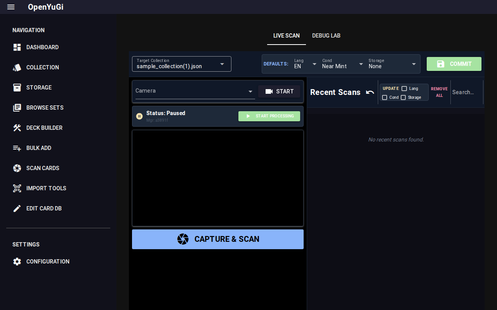

# AI Card Scanner

OpenYuGi features an experimental AI-powered scanner that can identify cards via your webcam.

## 1. Setup & Requirements

The scanner runs locally on your machine using advanced machine learning models.
- **GPU**: Recommended but not required (runs on CPU via ONNX/PyTorch).
- **Camera**: A generic webcam (1080p recommended).
- **Lighting**: Good, even lighting is crucial for accurate OCR.

**Technology Stack**:
- **Detection**: YOLOv8 (identifies card boundaries).
- **OCR**: EasyOCR or DocTR (reads Set Code and Name).
- **Matching**: YOLOv8 Classification (matches artwork against known database).

## 2. Scanning Workflow

### Step 1: Prepare
Navigate to the **Scan Cards** tab. Select your webcam from the dropdown in the left panel.
Select a **Target Collection** in the header (this is where confirmed cards will eventually go).

### Step 2: Scan
1. Place a card in the center of the camera view.
2. Click **CAPTURE & SCAN** (or press Spacebar if focused).
3. The system will:
    - Detect and crop the card.
    - Read the Set Code (e.g., `LOB-EN001`).
    - Match the artwork to verify the identity.
    - Check for "1st Edition" text.

### Step 3: Review
- **Success**: The card is automatically added to the **Recent Scans** list on the right.
- **Ambiguous**: If the scanner is unsure (e.g., multiple rarities exist for that code), an **Ambiguity Dialog** will appear asking you to confirm the correct version.
- **Failure**: A notification will alert you if no card was found. Try adjusting lighting or card angle.

### Step 4: Commit
The **Recent Scans** list acts as a staging area. You can:
- **Edit**: Click a card to change condition/language.
- **Batch Update**: Use the checkboxes in the header to set Language/Condition for all items.
- **Commit**: Click the **COMMIT** button to move all recent scans into your Target Collection.

### ⚠️ Important Warnings
- **Multiple Tabs**: Do **NOT** open the Scan page in multiple browser tabs. The ambiguity popup may be sent to the wrong tab, causing the interface to hang or misbehave.
- **Low Res Images**: Before using the "Art Style Match" feature (YOLO), ensure you have downloaded all low-resolution images from the **Settings** menu. The matcher needs these local files to function.

## 3. Configuration & Debugging

### Scan Settings
- **OCR Engine**: Switch between EasyOCR (faster) and DocTR (more accurate).
- **Preprocessing**: Adjust how the card is cropped (Classic vs AI).
- **Art Matching**: Toggle artwork verification (slower but more accurate).

### Debug Lab
The **Debug Lab** tab allows you to visualize every step of the pipeline.
- **Warped View**: See exactly what the OCR engine sees.
- **ROI Visualization**: See where the scanner is looking for text.
- **Log**: Detailed execution logs for troubleshooting.

This is useful if specific cards are failing to scan.
