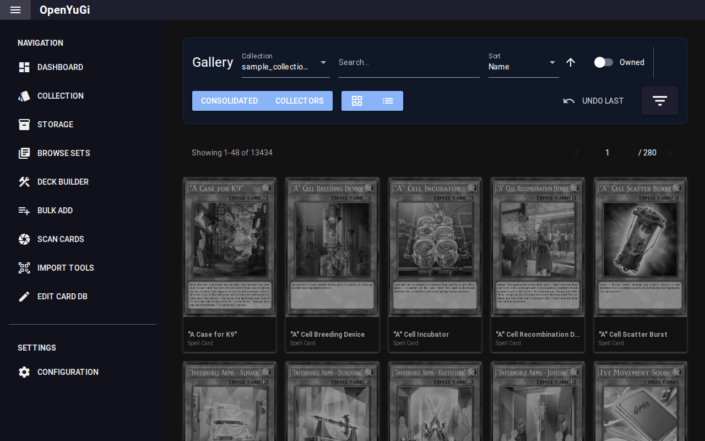
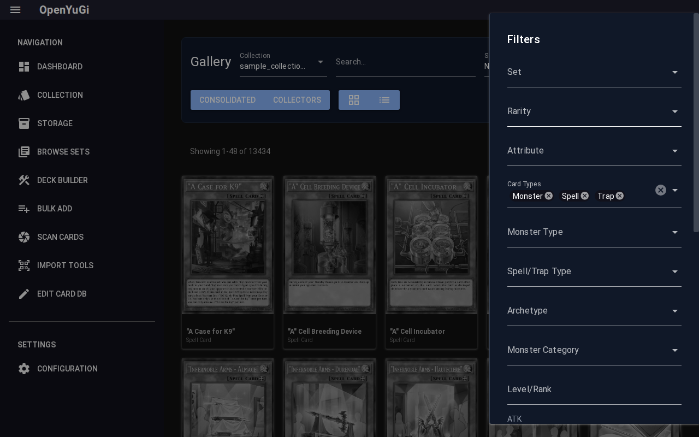
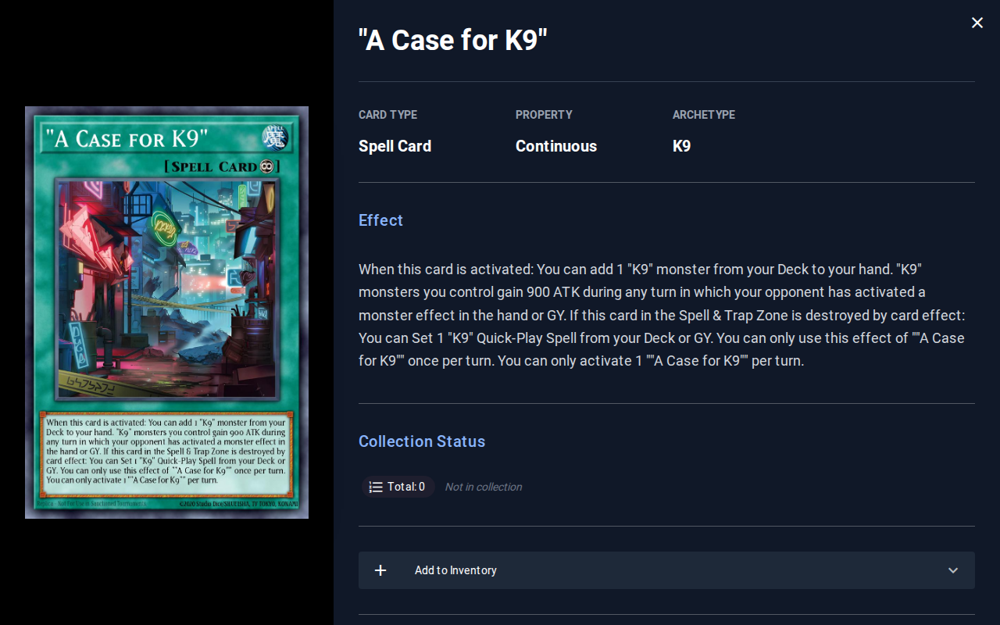

# Collection Manager

The Collection tab is the heart of your inventory management. It allows you to view, filter, sort, and edit every card you own.

## 1. Views
You can toggle between two main viewing modes using the buttons in the header:

### Consolidated View
- **Purpose**: Best for gameplay and deck building.
- **Display**: Groups all printings of a card together (e.g., "Total Owned: 5" for Blue-Eyes White Dragon).
- **Action**: Clicking a card opens the **Single Card View** to manage specific printings.

### Collectors View
- **Purpose**: Best for valuation and trading.
- **Display**: Lists every specific printing separately (e.g., "LOB-001 (Ultra) - 1x", "SDK-001 (Starter) - 1x").

## 2. Filters
Click the **Filter Button** (icon with sliders) on the right to open the Advanced Filter Pane.

- **Search**: Text search for name, description, or set code.
- **Attributes**: Filter by Card Type, Attribute, Level, Race, Archetype.
- **Stats**: Sliders for ATK, DEF, Price, and Owned Quantity.
- **Condition**: Filter by specific card conditions (Near Mint, Played, etc.).

## 3. Adding & Editing Cards
Clicking on any card opens the **Single Card View**.

This dialog allows precise management of a card's inventory.
- **Add/Remove**: Adjust quantity for specific sets.
- **Variant Selection**: Choose Set Code, Rarity, Condition, Language, and Edition.
- **Storage**: Assign the card to a specific Box or Binder directly from this view.
- **Save**: Commits changes to your collection.
