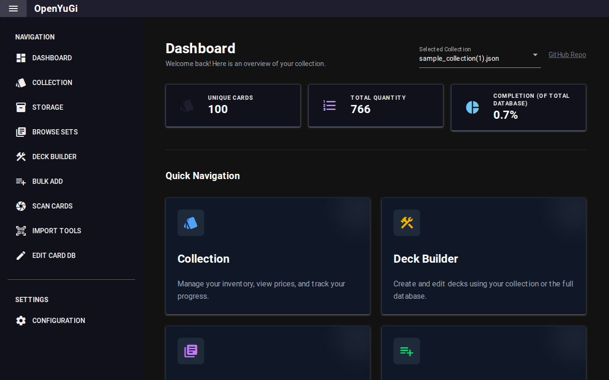

# Dashboard

The Dashboard provides a high-level overview of your collection.

## Key Metrics
- **Total Cards**: The total number of individual cards (including duplicates) in your collection.
- **Unique Cards**: The number of distinct card names you own.
- **Total Value**: Estimated market value based on TCGPlayer Low/Mid prices.

## Charts
- **Value Distribution**: Visualizes the rarity distribution of your collection.
- **Acquisition Rate**: Shows how your collection has grown over time.

## Recent Activity
Shows the most recently added cards, allowing you to quickly verify your latest imports or scans.
