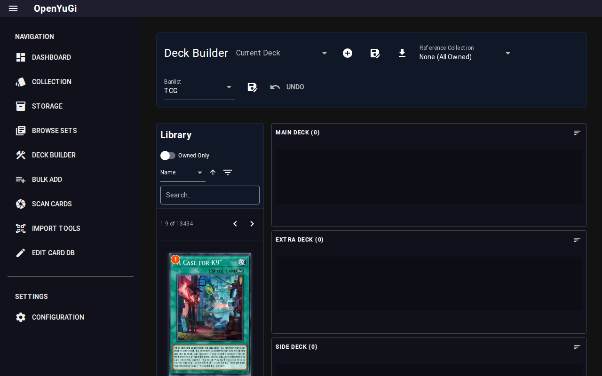

# Deck Builder

The Deck Builder allows you to construct decks using cards from your collection or the entire database.

## 1. Building a Deck
- **Card Pool**: The left panel shows available cards. You can filter this list just like the Collection view.
- **Drag & Drop**: Drag cards from the pool to the Main, Extra, or Side deck areas.
- **Right Click**: Right-click a card in the pool to quickly add it to the Main Deck.

## 2. Features
- **Banlist Validation**: The border of cards will change color (Red/Orange) if they are forbidden or limited in the current format.
- **Owned Count**: The green badge on cards indicates how many copies you actually own.
- **Stats**: The header displays the count of Monsters, Spells, and Traps in your deck.

## 3. Saving & Exporting
- **Save**: Decks are saved as `.ydk` files in `data/decks/`.
- **Export**: These files are compatible with standard simulators like EDOPro and YGOOmega.
