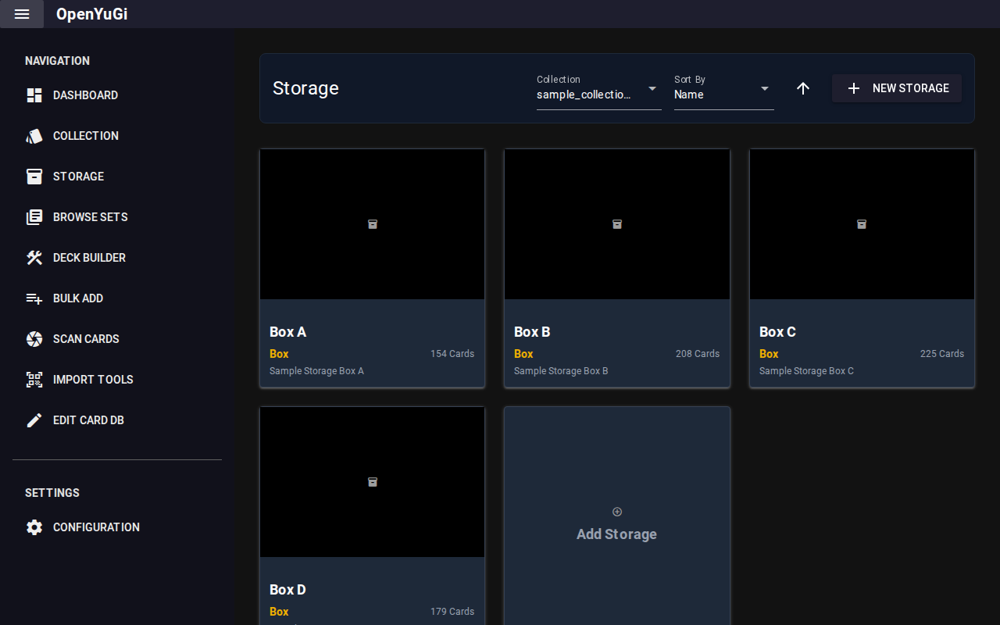
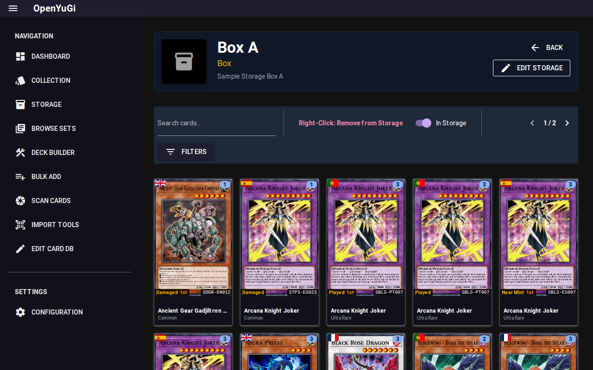

# Storage Management

The **Storage** tab allows you to organize your physical inventory into digital containers. This reflects how your cards are stored in real life (e.g., "Main Binder", "Bulk Box A", "ETB Box").

## 1. Creating Storage
To create a new container:
1. Click the **+ New Storage** button (or the large "Add Storage" card in the gallery).
2. Enter a **Name** (e.g., "Trade Binder").
3. Select a **Type**:
    - **Box**: Generic storage box.
    - **Binder**: For trade or collection binders.
    - **Sealed Product**: Special type for keeping track of sealed boxes, tins, or packs. When selected, you can link it to a specific Set (e.g., "Legend of Blue Eyes Booster Box") to automatically fetch its image.
4. (Optional) Add a description or upload a custom image (e.g., a photo of the actual box).

## 2. Viewing Contents
Click on any storage card in the gallery to open the **Detail View**.

This view shows only the cards located in that specific container.
- **Header**: Shows the image, name, and total card count.
- **Grid**: Displays cards with their quantity in this container.
- **Toggle "In Storage"**:
    - **ON (Default)**: Shows cards currently *inside* this box.
    - **OFF**: Shows "Unassigned" cards from your collection that are *not* in any box. This allows you to quickly move cards into this box.

## 3. Managing Inventory

### Adding Cards to Storage
There are two ways to add cards to a box:

**Method A: From Collection Tab**
1. Go to the main **Collection** tab.
2. Open a card's **Single Card View**.
3. In the inventory list, use the **Storage** dropdown to assign a specific copy to a location.

**Method B: From Storage Detail View**
1. Open the Storage Detail View (e.g., "Binder 1").
2. Toggle the **"In Storage"** switch to **OFF**. The view now shows unassigned cards.
3. **Right-Click** on any card to add 1 copy to the current storage.
4. Toggle the switch back to **ON** to see your added cards.

### Removing Cards
1. In the Storage Detail View (with "In Storage" ON).
2. **Right-Click** a card to remove 1 copy (it moves to "Unassigned").

## 4. Filtering
The Storage view supports the same powerful filtering system as the main collection.
1. Click the **Filter** button.
2. You can filter by Rarity, Set, Type, etc., *within* the current box. This is useful for finding specific cards in large bulk boxes.
